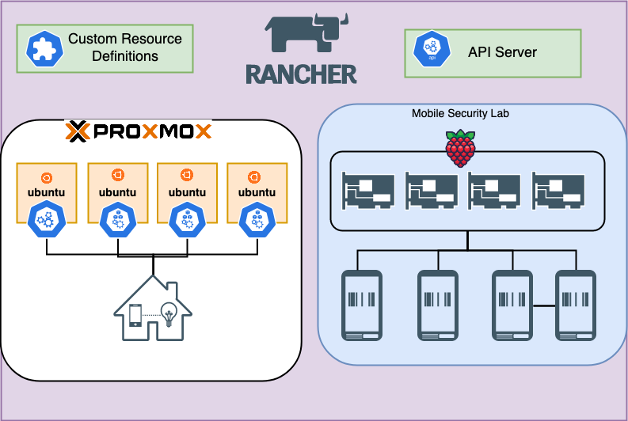

<div align="center">
  <p>A self hosted environment for home services</p>
  <p align="center">
    
  </p>
</div>

Destination for all homelab resource management

* [**HomeOps**](https://github.com/teaglebuilt/homeops) - located under `ops` controlling all `gitops` cicd processes on the kubernetes cluster.
* [**HomeWare**](https://github.com/teaglebuilt/homeware) - located under `ware` holding automation for provisioning all homelab infrastructure.
* [**HomeAssistant**](https://github.com/teaglebuilt/homeassistant) - located under `assistant` which utilizes homeassistant to centralize and develop solutions for smart home operations.
* [**Charts**](https://github.com/teaglebuilt/charts) - Packaged releases for kubernetes resources.


## Kubernetes

Running on a cluster of rasperry pi's and a cluseter of virtual machines. Rancher is used to manage both clusters.




## CICD


### Kubernetes Deployments

Grafana resources will be used to demonstrate how kubernetes deployments are managed.

**Packaging**
When a service infrastructure is complete and ready for deployment, it is then published to [**Helm Chart Releases**](https://github.com/teaglebuilt/charts) where it can be pulled from.


**Deployment**
In [HomeOps](https://github.com/teaglebuilt/homeops), [Flux](https://fluxcd.io/docs/) is used to manage deployments on the cluster. We use [CRDs]() by flux to define our gitops resources.

[Helm Release]() is the release manifest where we will reference the published helm chart as the source of the release. In the [release](https://github.com/teaglebuilt/homeops/blob/master/apps/prod/monitoring/grafana/release.yaml) for grafana, you can see the helm chart referenced
as below.
```yaml
chart:
    spec:
      chart: grafana
      version: 6.20.3
      sourceRef:
        kind: HelmRepository
        name: home-charts
        namespace: flux-system
      interval: 5m
```

A [HelmRepository](https://github.com/teaglebuilt/homeops/blob/master/repos/home.yaml) is created on the cluster for our packaged helm charts to enable flux to pull the release.

